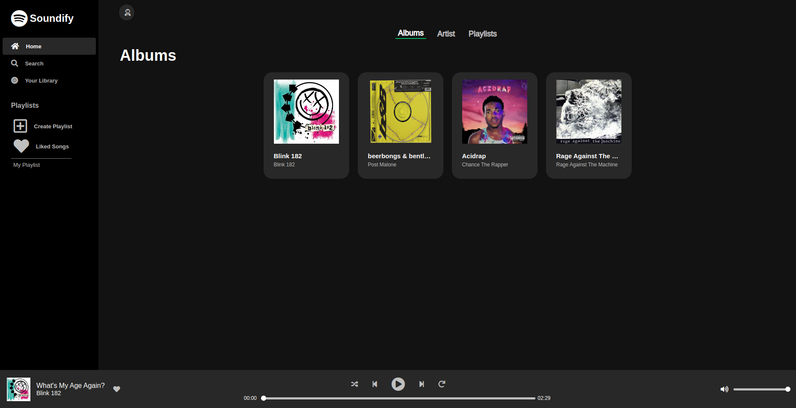
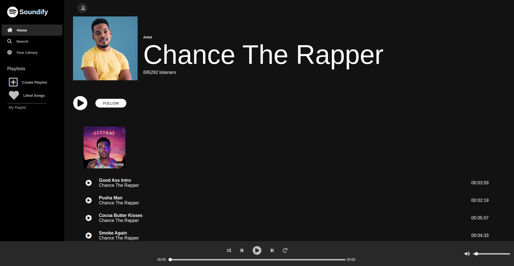
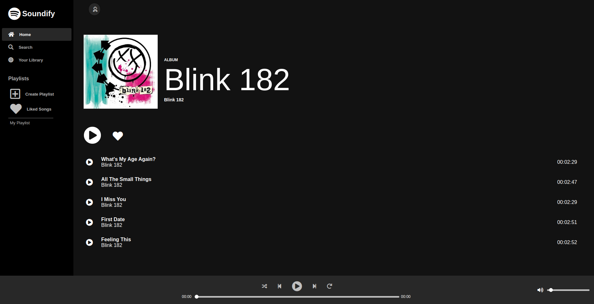
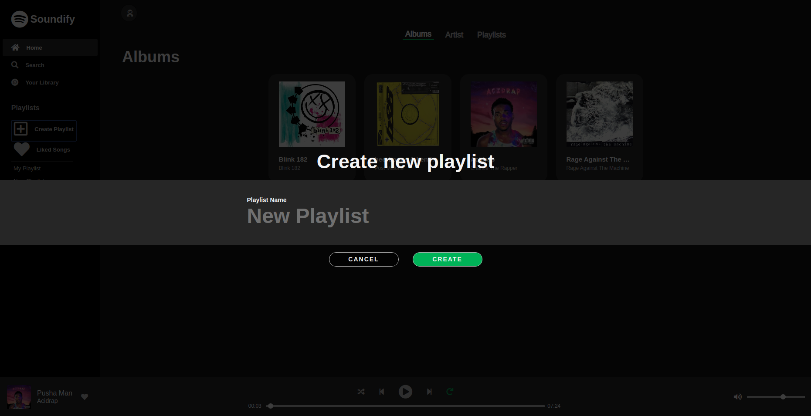

# Soundify

An audio streaming platform modeled after Spotify.

By [Aaron Pierskalla](https://github.com/ajpierskalla3), [Chris Tran](https://github.com/ctran01), and [James Robertson](https://www.github.com/jamesurobertson)

Soundify is an AJAX express app created with Node.js and Postgres.

- [Live Demo](https://soundify-demo.herokuapp.com)
- [Technologies](#Technologies)
- [Illustrations](#Illustrations)
- [Features](#Features)
- [Database Structure](#Database-Structure)
- [Troubleshooting](#Troubleshooting)

## Introduction

For our first full stack web app our group decided decided to make a clone of Spotify. Our goal was to put everything that we've been learning throughout our App Academy curriculum to use and create a challenging web app.

## Technologies

Project is created wtih

- Javascript ES6
- Postgres 12.2
- Node.js 12.16
- Express 4.17
- Sequelize
- BcryptJS
- Pug

## Illustrations

Home Page:

Artist Page:

Album Page:

Create Playlist Modal:

## Features

Soundify, at its core, is a music player app. A few of the main features are:

- User Auth via JSON web tokens
- Bcrypt hashing for password security
- Continuous play while navigation the site
- Create and add songs to Playlists
- Follow Artists, Albums, playlists, and other users
- Dynamic autocomplete Search

## Backend

Our backend is made up of a collection of REST Api's to query the database to receive information.

### Relational Database Model

We implemented a relational database schema to associate our data. One of larger database problems we came across was figuring out how to relate the followers table to all of the followable types. We decided to go with a polymorphic association to connect them all. This way, our databse doesn't have needless join tables and every followable peice of data can be identified on the follower table with the followableType and followableID columns.

## TroubleShooting

A few our main troubleshooting issues were:

- Setting up the polymorphic association on the follower table in the backend
- Realizing that we needed to use CSS Grid for our main template of the web app.
- Learning about HTML5 Audio tag and using it for our audio player
